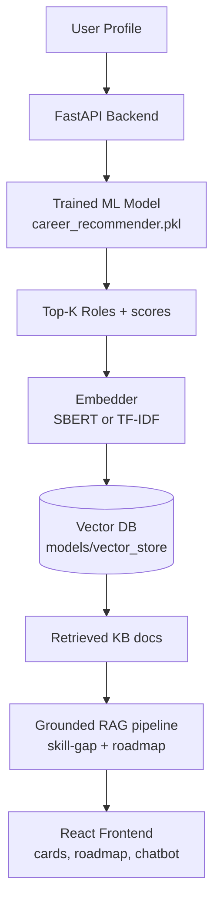

# 🚀 CareerPath AI — Career Pathway Knowledge Explorer (EMP-04)

> **Problem → Data → Model → Optimize → Evaluate → Prototype.** An ML-ranked, RAG-grounded career exploration system. The ML model predicts; RAG explains — strictly from a defined knowledge base.

**Live flow:** User Profile → ML Prediction (Top-K roles + scores) → Embedding Retrieval → Skill-Gap Analysis → Grounded Career Roadmap → Frontend Visualization + RAG Chatbot.

## 1. Problem Statement
Students/professionals can't map their skills → the right role → what to learn next. Generic LLM advice hallucinates certifications and paths. We ground every fact in a curated KB and rank roles with a **trained classifier**.

## 2. Solution
Hybrid system: **Random Forest classifier** (trained on 2,000-row synthetic dataset, 20 roles) ranks careers; **TF-IDF/SBERT + persisted vector DB** retrieves the relevant KB doc; a **grounded template pipeline** builds skill gaps + roadmaps using *only* KB text (no invented certs/tech/salaries). Chat answers cite sources.

## 3. Architecture


## 4. Dataset (SYNTHETIC — clearly documented)
- `data/career_dataset.csv` — **2,000 rows, 20 roles × 100 each**, generated by `scripts/generate_dataset.py` from per-role ideal skill/interest profiles + Gaussian noise (seed 42). Categorical jitter on education/experience/domain.
- Features (22): `education_level, python/java/cpp/javascript/sql/statistics/ml/cloud/web/data_analysis/cybersecurity/communication/problem_solving (0–10), interest_ai/data/web/cloud/security/embedded (0–10), experience_level, preferred_domain`. Target: `career_role`.
- ⚠️ Synthetic, not real-world data. Good for hackathon MVP; replace with survey/LinkedIn/O*NET data for production.

## 5. ML Model
- `ml/train.py`: ColumnTransformer (StandardScaler + OneHot) → compare **LogisticRegression / RandomForest / HistGradientBoosting** (+XGBoost if installed). Stratified 70/15/15 split, reproducible (seed 42). Validation/test accuracy, precision/recall/F1 and Top-1/3/5 are printed during training; the best model (by validation F1) is saved.
- Artifacts: `models/career_recommender.pkl`, `models/label_encoder.pkl`, `models/feature_meta.pkl`. Inference: `ml/predict.py`, `backend/recommender.py` (model loaded **once**, cached).

## 6. RAG Architecture
`knowledge_base/*.json` (20 docs) → `scripts/build_vector_database.py` (doc text → Embedder → L2-norm vectors → `models/vector_store/`) → cosine Top-K → `backend/rag.py` (skill-gap + roadmap + extractive chat answer, all fields copied verbatim from retrieved doc + `grounding_note` + `sources`).
- Embeddings: **SBERT (`all-MiniLM-L6-v2`) if `VECTOR_STORE=sbert`**, else **TF-IDF fallback** (default — zero heavy deps, deploy-friendly).
- Anti-hallucination: unknown roles → 404; empty retrieval → safe message; LLM never invents — offline grounded templates; optional `OPENAI_API_KEY` hook documented but not required.

## 7. Training Process
```bash
python scripts/generate_dataset.py --n 2000 --seed 42
python ml/train.py            # trains, compares, saves best model
python scripts/generate_kb.py
python scripts/build_vector_database.py
```

## 8. API Documentation
Base `http://localhost:8000`. Interactive docs at `/docs`.
| Method | Endpoint | Description |
|---|---|---|
| GET | `/health` | status |
| GET | `/careers` | 20 roles |
| GET | `/career/{name}` | KB doc |
| POST | `/predict-career` | profile → top-5 roles + reasons |
| POST | `/career-pathway` | profile + target → roadmap + skill gap |
| POST | `/chat` | RAG-grounded answer + sources |

Example: `POST /predict-career {"education":"Bachelor's","experience":"Fresher","skills":["Python","SQL"],"interests":["AI","Data"],"domain":"AI"}` → `Data Scientist 0.23…` etc.

## 9. Frontend
React 18 + Vite + React Router + Tailwind (CDN). Pages: Home, Assessment (toggles/sliders), Recommendations (match cards + reasons), Pathway (4-stage timeline), Career Detail, AI Assistant (chat with sources). `VITE_API_URL` points to backend.

## 10. Local Setup
```bash
# backend
python -m venv .venv && .venv\Scripts\activate   # (or source .venv/bin/activate)
pip install -r requirements.txt
cp .env.example .env
python scripts/generate_dataset.py && python ml/train.py && python scripts/generate_kb.py && python scripts/build_vector_database.py
uvicorn backend.main:app --reload --port 8000
# frontend (new terminal)
cd frontend && npm install && npm run dev   # http://localhost:5173
```

## 11. Deployment
- Frontend → **Vercel**: root `frontend/`, build `npm run build`, output `dist`, env `VITE_API_URL=<backend-url>`.
- Backend → **Render/Railway**: `Dockerfile` included (builds dataset→model→KB→vectors at image build); start `uvicorn backend.main:app --host 0.0.0.0 --port $PORT`. Set `VECTOR_STORE=tfidf` (default) for slim deploy.
- `docker-compose.yml` runs both locally.

## 12. Hackathon Stage Mapping
| Stage | Evidence |
|---|---|
| Problem | §1 + Home page |
| Data | `data/career_dataset.csv` + generator |
| Model | `ml/train.py`, saved `.pkl` |
| Optimize | §13 (cached model/embeddings, persisted VDB, Top-K, input validation) |
| Prototype | FastAPI + React, Docker, Vercel/Render ready |

## 13. Optimizations & Reliability
Cache embeddings + persisted VDB; model loaded once; Top-K limits docs; repeated-query cache; lightweight RF model; validation + 404s for unknown careers; confidence scores; ML-vs-RAG labeling in every response.

## 14. Future Improvements
Real survey data, SBERT+FAISS/Chroma, LLM rerank with citations, auth/saved roadmaps, course APIs, salary data from BLS/O*NET, A/B eval with RAGAS.

## 15. Run Commands (complete project)
```bash
cd career-pathway-explorer
pip install -r requirements.txt
python scripts/generate_dataset.py && python ml/train.py
python scripts/generate_kb.py && python scripts/build_vector_database.py
uvicorn backend.main:app --reload --port 8000   # API docs: http://localhost:8000/docs
cd frontend && npm install && npm run dev        # UI: http://localhost:5173
# tests:
python scripts/test_api.py
```
